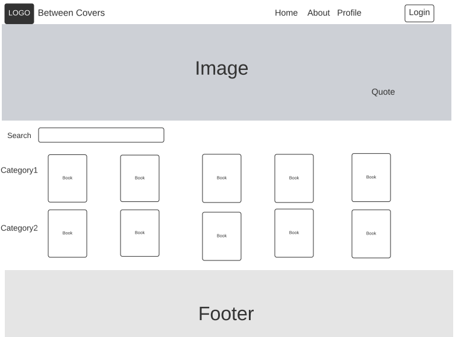
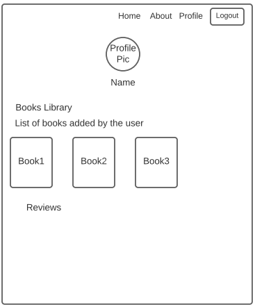

# Frontend-Between-Covers

Authers:
- Rawan Alazazi
- Sara Alhilo
- Leen Daufi
- Nada Alabduallah

## Project Overview
A book library application allows the users to search for their favorite books and to create their profile and add a list of their favorite books to their profiles.
The users can select their lovely books category and filter the books related to the category they selected.

## Wireframes Sample

- Home Page Wireframe
 
  

- Profile Page Wireframe                  

  

## Project Management Board on GitHub
Board URL:                
[Board](https://github.com/orgs/ReactDivers/projects/1)